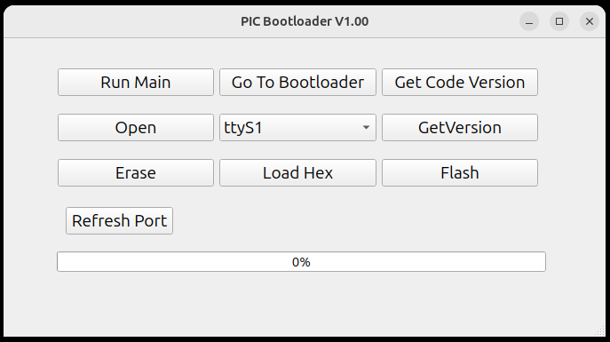

# Serial Bootloader GUI

This project is a **Qt-based GUI application** for programming and controlling microcontrollers via a serial port. It allows flashing hex firmware files, erasing chips, reading firmware versions, and managing baud rates.  



## Features

- **Serial Port Management:**  
  - Auto-detect available COM/serial ports.  
  - Open and close ports with configurable baud rates (115200, 1M, etc.).  
  - Refresh available port list.

- **Firmware Flashing:**  
  - Load Intel HEX files and convert them for flashing.  
  - Flash firmware to the microcontroller with progress tracking.  
  - Create and send flash and erase commands with CRC verification.  

- **Bootloader Commands:**  
  - Go to bootloader mode (`btlmain`).  
  - Run main application (`runmain`).  
  - Read bootloader and firmware version.  
  - Get code version from the device.

- **Error Handling:**  
  - Displays flash, erase, and port errors in the status bar.  
  - Validates responses from the microcontroller for reliable operation.

## GUI Overview

- **Port Selection:** Dropdown to select available serial ports.  
- **Open/Close Port:** Button to manage connection.  
- **Load HEX:** Button to select firmware hex files.  
- **Erase Chip:** Button to erase the connected microcontroller.  
- **Flash Firmware:** Button to program the selected hex file.  
- **Bootloader Controls:** Buttons to send bootloader commands or run main firmware.  
- **Status Bar:** Displays progress, success, and error messages.  
- **Progress Bar:** Shows flashing progress.

## Dependencies

- **Qt 5 or 6** (QtWidgets, QtSerialPort)  
- C++17 compatible compiler  

## Installation

1. **Clone the Repository:**
   ```bash
   git clone [<repository_url>](https://github.com/amin-amani/PICBootloader.git)
   cd SerialBootloaderGUI
